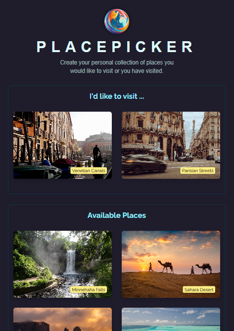
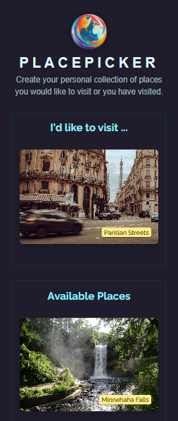
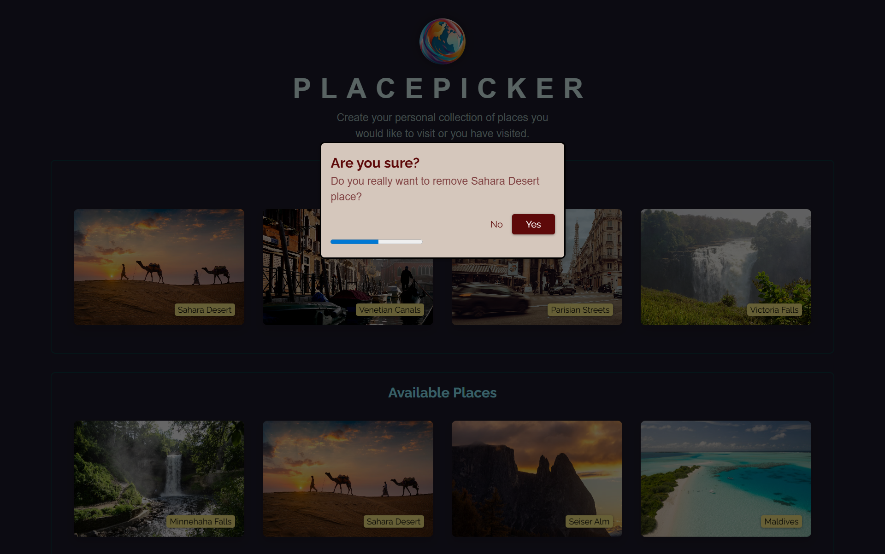

# 📌 Place Picker


A simple **React.js application** to create your personal collection of places you would like to visit or you have visited. You can select/unselect your favorite places easily.

This project started from a guided exercise, but I **significantly extended and customized it** with independent features, UX improvements, and design decisions — including dynamic modal content, auto-confirmation unselect with a countdown progress bar, **and fully responsive design for mobile, tablet, and desktop users**.

---

## 🚀 Features

- 📍 Sort available places based on user's current location (fallback to default order if permission is denied)
- 💾 Save picked places to localStorage
- ➕ Select new places and prevent duplicates with a warning modal
- ❌ Remove places with a controlled confirmation modal
- ⏳ Auto-confirm delete after 5 seconds, with a countdown progress bar
- 🎨 Dynamic modal content (success, warning, delete confirmation)
- 📱 Fully responsive design for mobile, tablet, and desktop users.

---

## 🛠️ Tech Stack

- **React** (hooks: useState, useRef, useEffect, useCallback)
- **React Portals** for modal rendering
- **Browser's localStorage**
- **Geolocation API** to get the user's current location for sorting with a default order if permission is denied
- **JavaScript (ES6+)**
- **CSS3/Styling**
- **Vite** (for development and build)

---

## 📂 Project Structure

```text
PlacePicker/
src/
├── assets/                 # Images and static files
│   ├── places/             # Place images
|   ├── screenshots/        # project's screenshots
│   └── logo.png            # App logo
│
├── components/             # Reusable components
│   ├── UI/                 # Shared UI components
│   │   ├── Modal.jsx
│   │   └── ProgressBar.jsx
│   ├── Places.jsx
│   └── DeleteConfirmation.jsx
│
├── data.js                 # Places dataset
├── loc.js                  # Distance calculation utilities
├── App.jsx                 # Root app component
├── main.jsx                # React entry point
└── index.css               # Global styles
```


---

## ⚙️ Installation & Usage

Clone the repo and install dependencies:

```bash
git clone git@github.com:smadi2512/place-picker.git
cd place-picker
npm install
npm run dev
```

Open your browser at http://localhost:5173 (Vite default).

---

## 📸 Screenshots

<table align="center">
  <tr>
    <td>
      <h4 align="center">PlacePicker desktop view</h4>
      
    </td>
    <td>
      <h4 align="center">PlacePicker tablet view</h4>
      
    </td>
  </tr>
  <tr>
    <td>
      <h4 align="center">PlacePicker mobile view</h4>
      </td>
    <td>
      <h4 align="center">Delete confirmation modal</h4>
      
    </td>
  </tr>
</table>

----
## 🧩 Future Improvements
- ➕ Lightbox with more details about a place
- 🌍 Add a map view with selected places highlighted.
- 🔎 Search & filter functionality for places.


---

## 👩‍💻 Author

Created by **Walaa Smadi**✨ \
Passionate React developer building modern, maintainable, scalable, performant, and user-friendly web apps.
- GitHub: [@smadi2512](https://github.com/smadi2512)
- LinkedIn: [Walaa Smadi](https://www.linkedin.com/in/walaa-bilal-smadi/)

Feel free to fork, star ⭐, and contribute!
